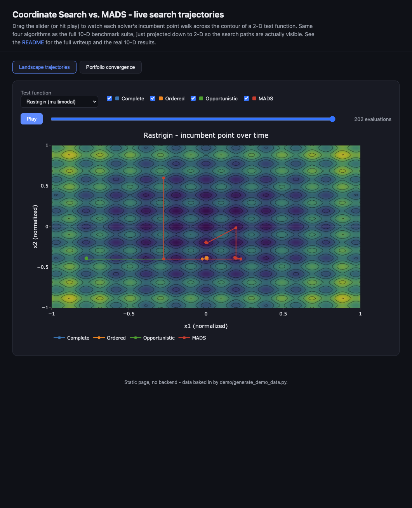
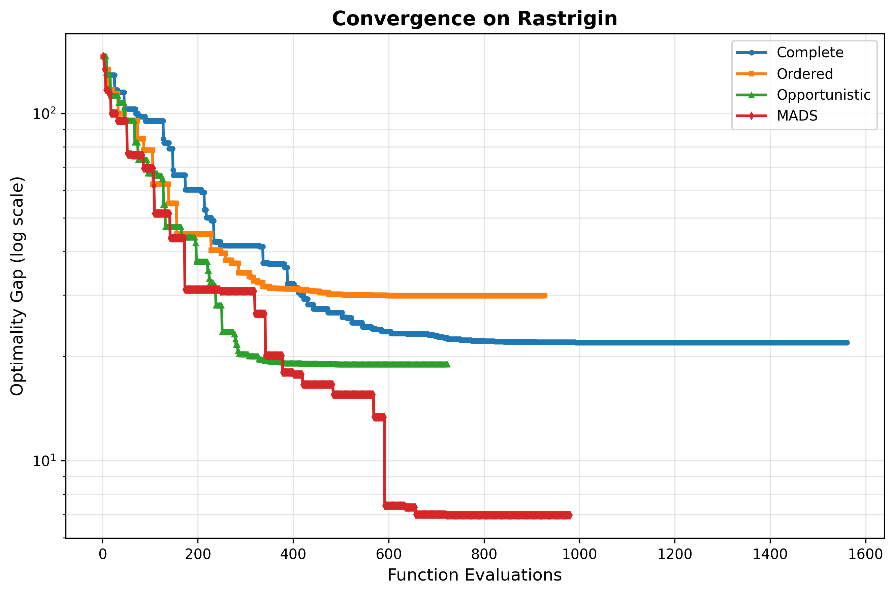
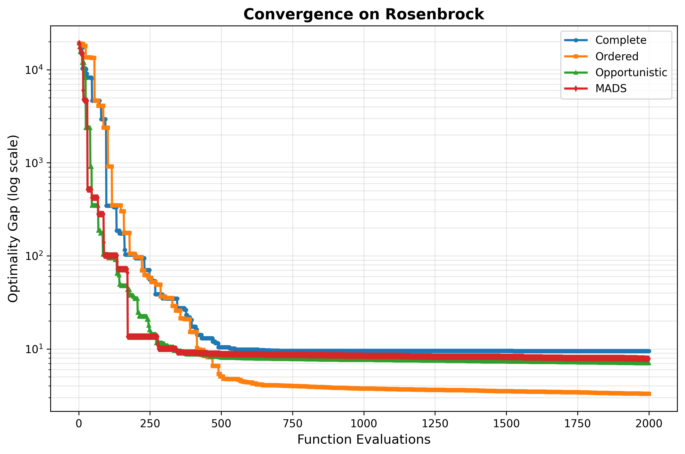

# Coordinate Search & MADS: a Derivative-Free Optimization Benchmark

**MATH462 (Derivative-Free Optimization) final project, extended past the original scope.**

This repo benchmarks four direct-search optimizers — three Coordinate Search
variants plus a from-scratch Mesh Adaptive Direct Search (MADS) with a
quadratic-surrogate search step — across seven blackbox problems: five
classic non-convex test functions with known global minima, an engineering
cost-simulator mock, and a small portfolio-construction problem (Sharpe
ratio net of transaction costs and CVaR risk). Everything is deterministic
and reproduces exactly from a clean checkout in about 15 seconds.



*Live in-browser demo — [`demo/index.html`](demo/index.html) — showing MADS's random-direction poll (red) jump clear of the local basin that traps the axis-aligned coordinate searches (blue/orange/green) on Rastrigin.*

## Why derivative-free optimization

Not every objective function you'd like to minimize is one you can
differentiate. Sometimes it's a compiled simulator you only get to call as
a black box (the SOLAR10 case here). Sometimes it's a backtest with sorts
and thresholds baked in — the portfolio problem in this repo computes a
CVaR risk penalty and an L1 transaction-cost term, both of which involve
control flow that doesn't hand you a clean gradient even though nothing
about the underlying math is exotic. Direct search methods (Coordinate
Search, Generating Set Search, MADS) are built for exactly this situation:
they only ever need to *call* the function and compare values, never
differentiate it.

## What's implemented

| Algorithm | File | Poll set | Key idea |
|---|---|---|---|
| Complete Coordinate Search | `experiments/algorithms.py` | fixed ±eᵢ axes | evaluate every direction, move to the best one |
| Ordered Coordinate Search | `experiments/algorithms.py` | fixed ±eᵢ axes | move on the first improving direction found |
| Opportunistic Coordinate Search | `experiments/algorithms.py` | shuffled ±eᵢ axes | ordered search, but re-shuffled every iteration |
| **MADS** (this project's addition) | `experiments/mads.py` | random orthogonal spanning set, regenerated every iteration | mesh/poll size hierarchy + a quadratic-model search step before every poll |

The first three all live in the same family: they only ever poll along the
coordinate axes, which means their search is intrinsically biased toward
directions that line up with the problem's own coordinate system. That's
fine for separable problems (`Sphere`) and fails in interesting ways on
problems with strong variable coupling or lots of local minima
(`Rosenbrock`, `Rastrigin`) — which is exactly the gap MADS is meant to
close.

### MADS in a bit more detail

MADS ([Audet & Dennis, 2006](https://doi.org/10.1137/040603371); see also
Audet & Hare's *Derivative-Free and Blackbox Optimization*) generalizes
Coordinate/Pattern Search by decoupling two step-size parameters:

- a **mesh size** Δᵏₘ that defines the grid trial points must land on, and
- a **poll size** Δᵏₚ = √Δᵏₘ that controls how far the poll actually looks,

and by polling along a **positive spanning set** that doesn't have to be
the coordinate axes. This implementation generates that set anew every
iteration: sample a random unit vector, build its Householder reflection
(an orthogonal matrix by construction), and use its columns — snapped onto
the current mesh — as the poll directions. Because reflecting through *any*
unit vector still gives an orthogonal basis, this is cheap to resample
every iteration while always producing a valid positive spanning set.

Before polling, there's a **search step**: fit

f(x_center + y) ≈ c + gᵀy + ½ yᵀ(h·y)

(a *diagonal* quadratic — only 2n+1 parameters, so it's identifiable from
a handful of nearby evaluated points) by least squares on the closest
previously-evaluated points, and jump straight to that model's minimizer
in closed form (each coordinate of a diagonal quadratic minimizes
independently). If that one extra evaluation improves on the incumbent,
the poll step is skipped entirely for that iteration. When the local model
is any good — which is most of the time, once there's enough history —
this buys several iterations' worth of progress for one evaluation instead
of up to 2n.

## The benchmark suite

| Problem | Known optimum? | Why it's here |
|---|---|---|
| Sphere | yes, f\*=0 | sanity check — every solver should crush this |
| Rosenbrock | yes, f\*=0 | narrow curved valley, strongly coupled variables |
| Rastrigin | yes, f\*=0 | highly multimodal — tests escaping local traps |
| Ackley | yes, f\*=0 | nearly flat far out, sharp well near the optimum |
| Levy | yes, f\*=0 | multimodal, different geometry than Rastrigin |
| SOLAR10 (mock) | no | the original assignment's engineering blackbox — see caveat below |
| Portfolio (`experiments/finance_problem.py`) | no | 10-asset allocation, maximize Sharpe net of turnover cost + CVaR risk penalty |

**SOLAR10 caveat:** the real SOLAR10 benchmark ships as a compiled NOMAD/C++
simulator that wasn't practical to build for this project, so
`experiments/solar_mock.py` is a hand-built stand-in with a similar
shape (five physically-bounded inputs, minimum around 42, a couple of
cross-terms) — not a faithful physical model. That's also exactly why the
suite doesn't stop there: benchmarking four solvers against one arbitrary
mock function with no ground truth doesn't actually tell you much. The
five classic functions give a real, verifiable optimality gap, and the
portfolio problem gives a second real-world-flavored blackbox that happens
to be closer to what you'd actually reach for a gradient-free method for
at a trading desk.

Every problem is evaluated at the same dimension (`DIM = 10`, from
`experiments/config.py`) and on the same domain, `[-1, 1]^10`; each
function internally rescales that into whatever range it's normally
tested on and shifts itself so the global optimum sits at `x = 0` (see
`experiments/test_functions.py`), so a single starting-point generator
and a single success criterion work for the whole suite.

## Methodology

**Instances.** 5 random starting points × 7 problems = 35 instances per
experiment, all four algorithms run on every instance from the same start
(`experiments/experiment_runner.py`). Everything is seeded
(`experiments/config.py: GLOBAL_SEED`, `INSTANCE_SEED_OFFSET`) so a clean
run reproduces bit-for-bit.

**Success criterion.** A run is a "success" once

final_f − f\* ≤ τ · (f0 − f\*)

where f\* is the analytic global minimum for the five classic functions,
or the best value any solver found for SOLAR10/Portfolio
(`experiments/profiles.py: compute_star_per_problem`). f0 is that
instance's starting value. τ ∈ {10⁻¹, 10⁻², 10⁻³} — looser to stricter.

**Data profiles.** For each algorithm, the fraction of the 35 instances
solved within a given evaluation budget (or CPU-time budget), swept over
the whole budget range — the standard way to compare derivative-free
solvers across a batch of problems
([Moré & Wild, 2009](https://doi.org/10.1137/080724083)).

**Significance testing** (`experiments/stats_tests.py`): a Friedman test
across all four algorithms' per-instance ranks, plus pairwise Wilcoxon
signed-rank tests (MADS vs. each coordinate search variant) on the
optimality gap, paired by instance.

## Results

Run with a 2000-evaluation budget (`python3 scripts/run_all.py`, see
[Reproducing](#reproducing-this) below):

**Mean optimality gap by problem** (lower is better):

| Problem | Complete | Ordered | Opportunistic | MADS |
|---|---|---|---|---|
| Sphere | 0.0000 | 0.0000 | 0.0000 | 0.0000 |
| Rosenbrock | 7.317 | 4.077 | 3.905 | 7.794 |
| **Rastrigin** | 25.67 | 24.87 | 28.46 | **2.985** |
| Ackley | 0.0049 | 0.0047 | 0.0047 | 0.0924 |
| Levy | 0.0000 | 0.0000 | 2.146 | 0.0001 |
| SOLAR10 (mock) | 0.0000 | 0.0000 | 0.0000 | 0.0001 |
| Portfolio | 0.0005 | 0.0003 | 0.0003 | 0.0001 |

MADS is roughly **8-9x closer to the global optimum than any coordinate
search variant on Rastrigin** — the one problem in the suite with genuinely
many local minima — which lines up with the theory: a poll direction set
that changes every iteration doesn't get trapped by the same local basin
the way a fixed axis-aligned poll can. It's not uniformly better, though:
on Ackley and Rosenbrock the coordinate searches still edge it out at this
budget. That trade-off shows up directly in the data profiles too:

| τ (tolerance) | Complete | Ordered | Opportunistic | MADS |
|---|---|---|---|---|
| 10⁻¹ (loose) | 91.4% | 88.6% | 88.6% | **100.0%** |
| 10⁻² | 85.7% | 85.7% | 82.9% | **88.6%** |
| 10⁻³ (strict) | 74.3% | **82.9%** | 77.1% | 62.9% |

MADS solves the whole suite at a loose tolerance faster than anything
else, but the coordinate searches can still eke out tighter final
precision given the full budget on the problems they're already good at.
A Friedman test across all four algorithms doesn't reject "no difference"
overall at 2000 evaluations (χ² = 3.56, p = 0.31) — the aggregate ranks are
close — but the Wilcoxon comparisons and the per-problem breakdown tell the
more useful story about *where* each method's advantage actually is.
Convergence curves for the two hardest problems:




(All of these numbers regenerate exactly from `results/*/raw_runs.csv`,
`results/*_significance.csv`, and `results/*_friedman.csv` after running
the pipeline — see below.)

## The interactive demo

`demo/index.html` is a static page (Plotly.js via CDN, no backend) with
two views:

1. **Landscape trajectories** — the incumbent point of each of the four
   algorithms, walking across a contour plot of 2-D Rosenbrock or
   Rastrigin. Scrub the slider or hit play.
2. **Portfolio convergence** — the same four algorithms' objective value
   vs. evaluations on the 10-asset portfolio problem.

The data is pre-baked into `demo/trajectories.js` by
`demo/generate_demo_data.py`, so the page works from a plain double-click
in most browsers, or:

```bash
cd demo
python3 -m http.server 8000
# then open http://localhost:8000
```

To regenerate the data (e.g. after changing an algorithm):

```bash
python3 demo/generate_demo_data.py
```

## Reproducing this

```bash
git clone https://github.com/AliasgarSakarwala/Math462-Coordinate-search-project.git
cd Math462-Coordinate-search-project
pip3 install -r requirements.txt
python3 scripts/run_all.py
```

Takes about 10-15 seconds. It runs the 500-eval and 2000-eval experiments
(35 instances × 4 algorithms each), computes success/data profiles for
τ ∈ {10⁻¹, 10⁻², 10⁻³}, and runs the significance tests, writing everything
to `results/`:

```
results/
├── N500_tau1e-3/
│   ├── raw_runs.csv               # every run: instance, problem, algo, f0, final_f, evals, cpu_time
│   ├── data_profile_evals.csv
│   ├── data_profile_time.csv
│   ├── data_profile_evals.png
│   └── data_profile_time.png
├── N500_tau1e-2/  ...  N500_tau1e-1/  (profiles only, raw data is the same across tau)
├── N500_significance.csv           # pairwise Wilcoxon tests, MADS vs each CS variant
├── N500_friedman.csv               # Friedman statistic + mean ranks
├── N2000_tau1e-3/  ...  N2000_tau1e-1/
├── N2000_significance.csv
└── N2000_friedman.csv
```

`results/` is gitignored on purpose — it's fully regenerated by the script
above, and every number in this README comes straight out of it. The
curated figures under `docs/assets/` are checked in so they render on
GitHub without anyone having to run anything first.

To regenerate just the convergence figures used above:

```bash
python3 scripts/generate_convergence_plots.py
```

**Dependencies:** `numpy`, `pandas`, `matplotlib`, `scipy` (see
`requirements.txt`).

## Project structure

```
experiments/
├── algorithms.py          # Complete / Ordered / Opportunistic coordinate search
├── mads.py                 # MADS: random spanning sets + quadratic search step
├── blackbox.py              # eval-count / cpu-time wrapper around any f(x) -> float
├── problems.py              # registry: every problem in the suite
├── test_functions.py        # Sphere, Rosenbrock, Rastrigin, Ackley, Levy
├── finance_problem.py       # portfolio Sharpe/CVaR blackbox
├── solar_mock.py             # SOLAR10 stand-in
├── config.py                 # dimension, budgets, step sizes, seeds
├── experiment_runner.py      # runs every algorithm on every instance
├── profiles.py                # success criterion + data profile construction
├── stats_tests.py             # Wilcoxon + Friedman significance tests
└── plots.py                    # data profile + convergence plotting

scripts/
├── run_all.py                  # main entry point - see Reproducing above
└── generate_convergence_plots.py

demo/
├── index.html / app.js / trajectories.js   # static interactive demo
└── generate_demo_data.py                    # regenerates trajectories.js

docs/assets/                    # curated plots/screenshots used in this README
results/                        # gitignored, regenerated by scripts/run_all.py
```

## References

- Audet, C. and Dennis, J.E., *Mesh Adaptive Direct Search Algorithms for
  Constrained Optimization*, SIAM J. Optimization, 2006.
- Audet, C. and Hare, W., *Derivative-Free and Blackbox Optimization*,
  Springer, 2017.
- Moré, J.J. and Wild, S.M., *Benchmarking Derivative-Free Optimization
  Algorithms*, SIAM J. Optimization, 2009.
